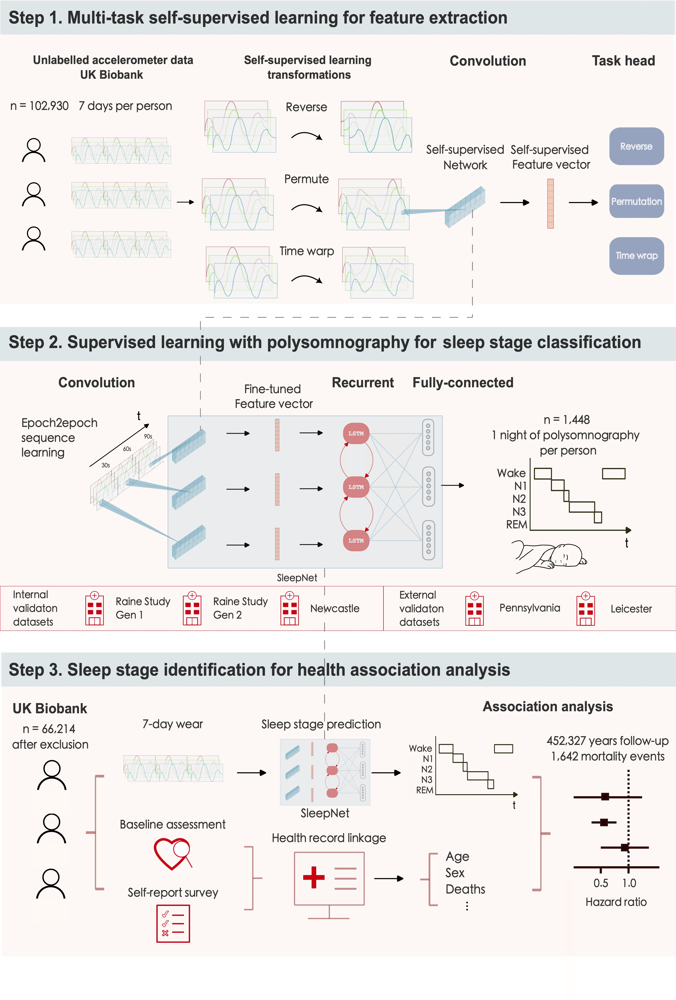

<!------------------------------------------ Hyperlinks ---------------------------------------------------->
<!--- If you want to update links for your code/paper/demo, modify that in _includes/page-header.html   -->
<!------------------------------------- End of hyperlinks -------------------------------------------------->


<!---------------------------------------------------------------------------------------------------------->
<!----------------------------------------- Abstract ------------------------------------------------------->
<hr>
  <p style="text-align: center;">Abstract</p>
  <p>
    <b>Background</b>: Sleep is essential to life. Accurate measurement and classification of sleep/wake and sleep stages is important in clinical studies for sleep disorder diagnoses and in the interpretation of data from consumer devices for monitoring physical and mental well-being. Existing non-polysomnography sleep classification techniques mainly rely on heuristic methods developed in relatively small cohorts. Thus, we aimed to establish the accuracy of wrist-worn accelerometers for sleep stage classification and subsequently describe the association between sleep duration and efficiency (proportion of total time asleep when in bed) with mortality outcomes. 
    
    <br><br>
    <b>Methods</b>: We developed and validated a self-supervised deep neural network for sleep stage classification using concurrent laboratory-based polysomnography and accelerometry data from three countries (Australia, the UK, and the USA). The model was validated within-cohort using subject-wise five-fold cross-validation for sleep-wake classification and in a three-class setting for sleep stage classification {wake, rapid-eye-movement sleep (REM), non-rapid-eye-movement sleep (NREM)} and by external validation. We assessed the face validity of our model for population inference by applying the model to the UK Biobank with ~100,000 participants, each of whom wore a wristband for up to seven days. The derived sleep parameters were used in a Cox regression model to study the association of sleep duration and sleep efficiency with all-cause mortality.

    <br><br>
    <b>Findings</b>: After exclusion, 1,448 participant nights of data were used to train the sleep classifier. The difference between polysomnography and the model classifications on the external validation was 34.7 minutes (95% limits of agreement (LoA):  -37.8 to 107.2 minutes) for total sleep duration, 2.6 minutes for REM duration (95% LoA:  -68.4 to 73.4 minutes) and 32.1 minutes (95% LoA:  -54.4 to 118.5 minutes) for NREM duration. The derived sleep architecture estimate in the UK Biobank sample showed good face validity. Among 66,214 UK Biobank participants, 1,642 mortality events were observed. Short sleepers (<6 hours) had a higher risk of mortality compared to participants with normal sleep duration (6 to 7.9 hours), regardless of whether they had low sleep efficiency (Hazard ratios (HRs): 1.69; 95% confidence intervals (CIs): 1.28 to 2.24 ) or high sleep efficiency (HRs: 1.42; 95% CIs: 1.14  to 1.77).
    
    <br><br>
    <b>Interpretation</b>: Deep-learning-based sleep classification using accelerometers has a fair to moderate agreement with polysomnography. Our findings suggest that having short overnight sleep confers mortality risk irrespective of sleep continuity.

  </p>
<hr>

<!--------------------------------------- End abstract ----------------------------------------------------->
<!---------------------------------------------------------------------------------------------------------->


<!---------------------------------------------------------------------------------------------------------->
<!------------------------------------------ Main body ------------------------------------------------------>
## Summary in plain language
Sleep is essential to life. Humans spend 1/3 of their life in sleep, and yet we don't pay enough attention to it.
There is this social stigma in society that successful people don't need to need much sleep as long as the sleep
quality is good. However, our study shows that short sleepers have a higher risk of mortality compared to
participants with normal sleep duration regardless of their sleep efficiency, a metric for sleep quality and continuity.
Immediate public health attention is required to better understand the role of sleep in health and diseases.

To help researchers and clinicians to study sleep, we developed a deep learning model that can classify sleep stages
that can be used in both small-scale clinical populations and large-scale population studies. We further demonstrated
how one could use the model in a large-scale population study to study the association between sleep and mortality.
Others can use the same study design to investigate the association between sleep and other health outcomes of interest.

You can use all the models developed in this project to derive sleep parameters in your studies by using the
[asleep](https://github.com/OxWearables/asleep) package.
## Using to use the package 
### Installation
```shell
pip install asleep
```

### Usage
```shell
# Process an AX3 file
$ get_sleep sample.cwa

# Or an ActiGraph file
$ get_sleep sample.gt3x

# Or a GENEActiv file
$ get_sleep sample.bin

# Or a CSV file (see data format below)
$ get_sleep sample.csv
```


# Study design

1. **Pre-trained a deep neural network using a self-supervised learning with 700,000 person-days of data in the UK Biobank.**

2. **Developed a sleep stage classifier using 1,448 nights of polysomnography and accelerometry data from three countries (Australia, the UK, and the USA).**

3. **Deployed the sleep stage classifier on the UK Biobank to study the association of sleep duration and sleep efficiency with all-cause mortality.**




# Results

###  Deep-learning-based sleep classification using accelerometers has a fair to moderate agreement with polysomnography.


### Sleep variations in the UK Biobank


### Short sleep duration is associated with mortality regardless of sleep efficiency


## Bibliography

```tex
@article {Yuan2023.07.07.23292251,
	author = {Hang Yuan and Tatiana Plekhanova and Rosemary Walmsley and Amy C. Reynolds and Kathleen J. Maddison and Maja Bucan and Philip Gehrman and Alex Rowlands and David W. Ray and Derrick Bennett and Joanne McVeigh and Leon Straker and Peter Eastwood and Simon D. Kyle and Aiden Doherty},
	title = {Self-supervised learning of accelerometer data provides new insights for sleep and its association with mortality},
	elocation-id = {2023.07.07.23292251},
	year = {2023},
	doi = {10.1101/2023.07.07.23292251},
	publisher = {Cold Spring Harbor Laboratory Press},
	URL = {https://www.medrxiv.org/content/early/2023/07/08/2023.07.07.23292251},
	eprint = {https://www.medrxiv.org/content/early/2023/07/08/2023.07.07.23292251.full.pdf},
	journal = {medRxiv}
}
```


## Acknowledgement


> We would like to thank all the study participants and collaborators and also Novo Nordisk for providing the primary funding for this project.